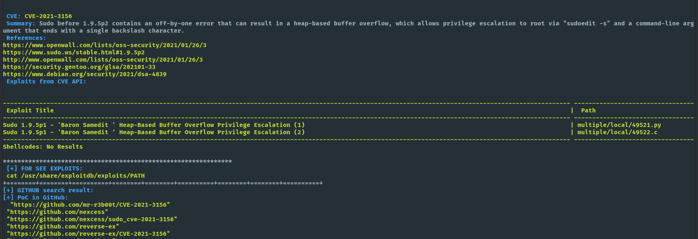

<h4 align="center">
<h1 align="center"> CVE Details Fetcher</h1>
<h/3>
<p align="center">
  <a href="https://github.com/fernandobortotti/search_cve" target="_blank">
    
     <a href="https://github.com/fernandobortotti/search_cve/issues"></a>
    <a href="https://github.com/fernandobortotti/search_cve/contributors"></a>
  </a>

</p>

This script fetches and displays details about specified CVE (Common Vulnerabilities and Exposures) IDs using the CIRCL CVE API. It also checks for available exploits related to the CVE IDs using `searchsploit` and [nomi-sec](https://github.com/nomi-sec/PoC-in-GitHub).


## Prerequisites

Ensure the following tools are installed on your system:

- `curl`
- `jq`
- `searchsploit`

You can install them using the following commands:

```bash
sudo apt-get install curl jq exploitdb
```

or you can use the following commands:

```shell
git clone https://gitlab.com/exploit-database/exploitdb.git
```

## Script Usage

Make sure to set the appropriate permissions to execute the script:

```bash
chmod +x cve_details_fetcher.sh
```

### Command-Line Arguments

- `--cve <CVE ID>`: Specify a single CVE ID to fetch details for.
- `--list <CVE list file>`: Specify a file containing a list of CVE IDs, one per line.
- `--ref <number of references to show>`: (Optional) Specify the number of references to display. Default is 3.
- `--e`: (Optional) Include this flag to show exploits related to the CVE from the CVE API and `searchsploit`.

### Examples

1. Fetch details for a single CVE ID:

```bash
./cve_details_fetcher.sh --cve 2022-0001
```

2. Fetch details for a single CVE ID and show related exploits:

```bash
./cve_details_fetcher.sh --cve 2022-0001 --e
```

3. Fetch details for a list of CVE IDs from a file:

```bash
./cve_details_fetcher.sh --list cve_list.txt
```

4. Fetch details for a list of CVE IDs from a file and show related exploits:

```bash
./cve_details_fetcher.sh --list cve_list.txt --e
```

To fetch and display details for multiple CVE IDs from a file:

```bash
./cve_details_fetcher.sh --list cve_list.txt --ref 5 --e
```



## Feature

- [ ] Option to show only exploit.


## Notes

- Ensure `searchsploit` is correctly configured and its path is added to your `PATH` environment variable.
- Adjust the script and commands as needed based on your environment and requirements.

<p align="center">Copyright &copy; 2022-present <a href="https://github.com/fernandobortotti" target="_blank">bortotti Org</a>

